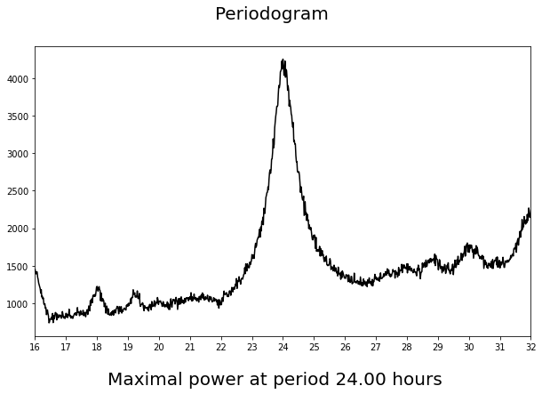

Chronobiology
=============

A python package to calculate and plot circadian cycles data.

Introduction
------------

Circadian rhythms are ~24 hour cycles of physiology and behaviour that occur in virtually all
organisms from bacteria to man. These rhythms are generated by an internal biological clock
and persist even in isolation from any external environmental cues.
In humans, circadian rhythms in activity are typically measured using calibrated wrist-worn
accelerometers. By contrast, the activity of laboratory animals is typically measured using home cage
running wheels. Circadian data are typically double plotted as actograms, showing activity across multiple days.

The circadian field has developed standard methods for analysing circadian rhythms. This primarily includes methods to
detect recurring features in the data, enabling the period length of activity cycles to be determined.
Under entrained conditions, this period will normally be determined by environmental zeitgebers
A range of different methods are used to determine the underlying period in biological time series.
Three of the most commonly used are the Enright periodogram, Fourier analysis and the
Lomb-Scargle periodogram. In addition, activity onset is also frequently used to characterise phase
shifts in rhythms in response to environmental zeitgebers.

Circadian disruption may occur as a result of environmental conditions.
This includes misalignment (when two or more rhythms adopt an abnormal phase relationship)
and desynchrony (when two or more rhythms exhibit a different period).
A range of approaches have been used to assess circadian disruption.
These methods range from simple visual inspection of actograms to metrics such as periodogram
power, variability in activity onset, light phase activity, activity bouts, interdaily stability, intradaily
variability and relative amplitude.

This package provides a set of tools to calculate and plot these parameters based on activity
measurements for further inspection and analysis.

For more theory see the following paper:

:download:`Telling the Time with a Broken Clock: Quantifying Circadian Disruption in Animal Models <paper.pdf>`

.. toctree::
    :caption: Contents:
    :maxdepth: 4

    installation
    storing_data
    selecting_data
    analyzing_data
    chronobiology

Indices and tables
==================

* :ref:`genindex`
* :doc:`modules_index`
* :doc:`downloads_index`
